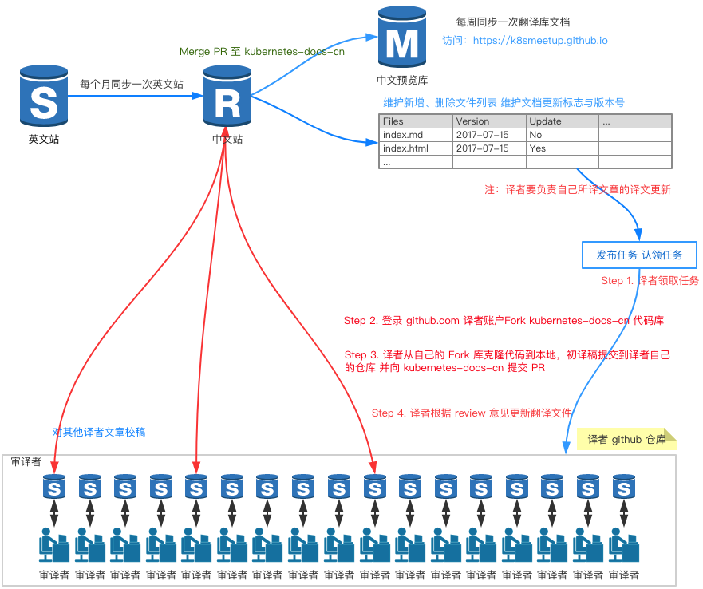

# K8SMeetup 翻译流程与翻译校稿规范

time：2017-07-13 update：2017-12-21 author：xiaolong@caicloud.io

K8SMeetup 维护两个仓库：

- 一个版本中文翻译库 [kubernetes-docs-cn](https://github.com/kubernetes/kubernetes-docs-cn) 每个月会同步一次 [website](https://github.com/kubernetes/website)的文档库。
- 一个版本中文预览库 [k8smeetup.github.io](https://github.com/k8smeetup/k8smeetup.github.io)
此库我们会将原始英文剔除，如果需要可以直接从预览库提取，免除删除原文的过程,可以[点此](https://k8smeetup.github.io)访问 `Kubernetes` 中文站点。

**翻译流程: 讲解译者如何参与 `Kubernetes` 中文化文档翻译的过程。**

**校稿规范: 讲解如何预定翻译文档的校验，以提升翻译质量，提供版本控制与翻译文件更新样例，提示如何更新翻译文件。**

**注：所有的翻译文件，都要保留原文，一段英文，一段中文，且中英文间隔不要太长，以方便大家 `review`，保证翻译质量。**

`K8SMeetup` 翻译社区 [DashBoard](https://k8smeetup.github.io/chart)，附每周的翻译[文章汇总](contribution.md)。建议翻译之前，了解一下[上游贡献流程](upstream-pr.md)。

后期计划: 考虑到英文版本的文档已经可以多版本预览，后期我们也会推出多版本的翻译方法，考虑到社区当前的实际情况，还是维持每月一更的态势，重点是把最新版本的`Kubernetes`资料译好,后面在扩展多版本的翻译分支。
## 一、k8s 翻译流程讲解



### Step 1. 领取翻译任务

任务地址：[翻译任务](https://docs.google.com/spreadsheets/d/1FDFCv9RK5nSMgLXhPrJ5k7r5QvHnNEFnXbvoFiM8v20/edit#gid=1015862274)

文章有六种状态：

参考颜色代码： http://tool.oschina.net/commons?type=3

1. Not Started  - 未翻译(默认白色背景) 可领取任务

2. Translating  - 领取任务状态(默认 Salmon 背景) -  250 128 114	#FA8072

3. Pull Request Sent - 已往 K8SMeetup 提交翻译PR(默认 LightGoldenrod1 背景) - 255 236 139	#FFEC8B

4. Under Internal Review - 内部 Review 状态(默认 DeepSkyBlue 背景) - 0 191 255	#00BFFF

5. Pull Request Merged - 已合并 K8SMeetup 代码库(默认 LightGreen 背景) - 144 238 144	#90EE90

6. Upstream Request Merged - 已合并到上游 (默认 LimeGreen 背景) - 50 205 50	#32CD32


### Step 2. 准备翻译文档

注册译者自己的 GITHUB 账户

Fork [K8SMeetup](https://github.com/kubernetes/kubernetes-docs-cn) 代码库到译者自己的 Github 账户

### Step 3. 开始翻译并向 `kubernetes-docs-cn` 提交PR
译者在本地，克隆代码库
打开 https://github.com/译者账户/kubernetes-docs-cn
```
mkdir work
cd work
git clone https://github.com/译者账户/kubernetes-docs-cn.git
```
翻译文件，看一下翻译过的文件
```
cd ~/work/kubernetes.github.io
git status
```
添加修改过的文件至暂存区
```
// 例如翻译的文件是 docs/setup/index.md
git add docs/setup/index.md
```
提交到自己的本地库
```
// 翻译文件命名规则：文件夹间隔用 - 连接线代替，后面跟pr标志并加上文件版本日期
git commit -m 'setup-index-pr-2017-12-15'
// push 到译者的github仓库 (输入用户名+密码)
git push
```
在译者的代码库创建PR

### Step 4. 根据 review 意见完成修改

```
git add docs/setup/index.md
git commit -m 'setup-index-pr-2017-12-15'
git push
```

## 二、Kubernetes 文档翻译校对

### 为什么要进行校对

文档初稿翻译难免会有不太理想的地方，所以我们希望能有更多人志愿参与校对工作，进一步完善 Kubernetes 中文文档。

### kubernetes.io 文档的构成

Kubernetes 文档由若干 `md` 和 `html` 文档构成,翻译即是将原始 `md` 和 `html`文件中需要翻译的文字用 tag 注释包起来，然后再拷贝一份进行翻译。原始英文用符号 `<!-- -->` 注释掉，每一段英文，对应一段中文，方便其他译者 review，如下例：

```
<!--
#### Kubernetes is

* **Portable**: public, private, hybrid, multi-cloud
* **Extensible**: modular, pluggable, hookable, composable
* **Self-healing**: auto-placement, auto-restart, auto-replication, auto-scaling
-->

#### Kubernetes 具有如下特点:

* **便携性**: 无论公有云、私有云、混合云还是多云架构都全面支持
* **可扩展**: 它是模块化、可插拔、可挂载、可组合的，支持各种形式的扩展
* **自修复**: 它可以自保持应用状态、可自重启、自复制、自缩放的，通过声明式语法提供了强大的自修复能力
```

注意： 在页头增加元数据 `metadata`, `cn-approvers` 写上译者的 `github` 用户名，如果有多个译者写个多个译者的 `github` 用户名，`cn-review` 写上帮忙 `review` 的其他译者，同样也支持多个 `review` 译者。文章有更新，`cn-approvers-update` 也需要加上更新的译者用户名，示例如下：

```
---
title: 通过聚合层扩展 kubernetes API
approvers:
- lavalamp
- cheftako
- chenopis
cn-approvers:
- rootsongjc
- xxx
cn-approvers-update:
- rootsongjc
- xxx
cn-reviewers:
- markthink
- xxx
---
```

注：加入元数据，方便上游跟踪文件的译者、更新译者与 `review` 译者。对于文章的 `review` 作者由译者负责更新 `cn-reviewers` 字段内容。

### 翻译规范

- 翻译之前，需参考[术语表](https://docs.google.com/spreadsheets/d/1JXSdoq93J4KnXA3JTQzWvrl2ZbGOMzrWKuyPjEVpUFg/edit#gid=0)以规范翻译一致性。
- 译文中的英文与中文建议用空格分隔
- Kubernetes 资源对象如：`Deployment`、`Service`、`ConfigMap` 等不需要翻译，尽可能用原始英文。
- 翻译的中英文间隔不宜过长，尽可能一段英文注释，一段中文翻译，可以前后对应，方便其他译者协助 review。
- 保持原始 `md` 或 `html` 格式不变，例如 **\_Server\_** 翻译成 **\_服务器\_**
- 对于长文章翻译要注意锚点链接不要移除，例如 **\[Server](#Client)** 翻译成 **\[服务器](#Client)** 锚点链接保留，但不翻译。
- `md` 代码块与代码输出内容也不要翻译
- 如果是多人合译的文章，需要同步好翻译进度

### 参与规则

- 校对者只需要具备基本的 kubernetes 知识,能够理解文档中讲述的内容即可
- 校对作业以 `md/html` 为单位，但对于很大的 `md` 或 `html` 文件，也可以按主题拆分成多份
- 为了避免不必要的重复翻译或校对，翻译或校对前先在[分工及进度]中对要翻译或校对的文件进行预定
- 预定校对作业时，以文件为单位，不建议一次预定太多，希望量力而行
- 预定了某个 `md` 或 `html` 文件并不代表别人不会同时修改此文件，所以如果克隆了`git`仓库到本地，仍然要注意及时从远程仓库同步更新
- 如果某个 `md` 或 `html` 文件的校对工作进展缓慢，或某个已校对的 `md` 或 `html`文件仍有翻译问题，可以对正在校对或已经校对过的文件进行再次校对
- 由于每个月我们会同步一次最新的版本，需要译者对自己所译的文件内容更新负责
- 有任何问题，可以发 Issues 或 在微信群里讨论


### 校对步骤

- 登录github
  如果还没有github账号，先注册一个，然后登录。
- 校对预定
  点击[任务分配置表](https://docs.google.com/spreadsheets/d/1FDFCv9RK5nSMgLXhPrJ5k7r5QvHnNEFnXbvoFiM8v20/edit#gid=1015862274)，预定指定的 `md` 或 `html` 文件, 在后面填上自己的 `github` 的用户名，比如 `校对预定By:@markthink`。 同时把此文件的的状态从`Translating`改成`Under Internal Review`，对于很大的文件，也可以只预定其中的一部门标题，比如：`校对预定By:[起始标题-结束标题]@markthink`
- 检查译文
  对照英文原文检查译文,可以点开对应文件的链接，对照 `md` 或 `html` 中被注释的英文原文进行检查(发现问题可以在线修改),或提交 `Comment` 给译者。
- 问题纠正
  对于译者，如果发现问题，可直接修改 `md` 或 `html`文件，对暂时不太好处理的问题可以发行issues报告。
- 状态更新
  校对完成后在[作业分工及进度]中更新校对状态，比如`校对完成By:@markthink`。同时把翻译文件的的状态从`Under Internal Review`改成`Pull Request Sent`。

## 三、版本控制与翻译文件更新样例

初始化`md`或`html`文件会有两个文件,例如：
```
/*在原始文件上翻译-保留原始英文*/
/docs/tutorials/object-management-kubectl/object-management.md
/*用于版本差异更新使用，不需要翻译*/
/docs/tutorials/object-management-kubectl/object-management-2017-7-15.md
```
有日期的文件是版本控制用的，不需要翻译 `object-management-2017-7-15.md` 在`object-management.md`原文中翻译。
每个月会同步版本文件，如果`object-management.md`未更新，不会创建新文件，如果`object-management.md` 有新的更新，会生成一个新的日期文件`object-management-2017-8-15.md`，译者的更新步骤如下：

- 更新源码库
- 比较`object-management-2017-7-15.md`和`object-management-2017-8-15.md`文件，找出新增的差异化英文
- 将新的差异化英文更新至 `object-management.md` 文件
- 删除旧版本日期文件 `object-management-2017-7-15.md`
- 提交新的PR文件，格式`object-management-pr-2017-8-15`，这里的日期是文件的版本日期

简单而言就是如果有两个带日期字样的 `md` 或 `html` 文件，就需要译者同步更新中文内容，同时把旧日期的版本删除。

## 谢谢您!

Kubernetes 在社区参与中茁壮成长，中文库总是保持翻译文件同时仅有一个最新日期的原始文件，以保持与官网文档的更新,我们非常感谢您对我们的网站和文档的贡献！
