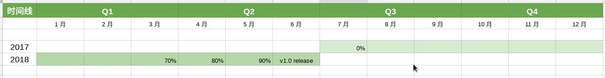

# K8SMeetup 翻译社区版本发布路线图

自2017年7月启动翻译工作，截止至今有60多位译者加入，有效活跃译者30余位。翻译完成进度约70%。通过社区协作，每月同步 `website` 更新，每周进行周译更新，通过 `Google Docs` 通力协作，形成了完善的翻译流程和参与体系。

[路线图地址](https://docs.google.com/spreadsheets/d/1fQk1mA0WvWVKXbKqQludlEpodzQ97Rsp78IkEU3swZ4/edit#gid=0)

按路线图，在周年之际发布第一个全量版本的中文文档。